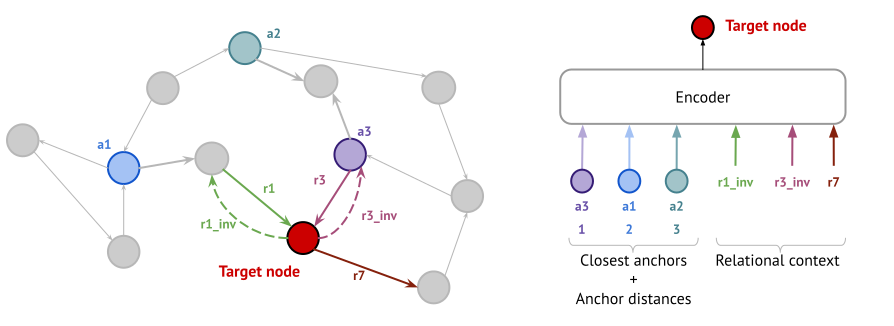

# NodePiece - Compositional and Parameter-Efficient Representations for Large Knowledge Graphs

<p align="center">

<a href="https://github.com/migalkin/NodePiece/blob/master/LICENSE">
    </a>
<a href="https://openreview.net/forum?id=xMJWUKJnFSw"></a>
<a href="https://mgalkin.medium.com/nodepiece-tokenizing-knowledge-graphs-6dd2b91847aa"></a>
</p>



NodePiece is a "tokenizer" for reducing entity vocabulary size in knowledge graphs. 
Instead of shallow embedding every node to a vector, we first "tokenize" each node by K anchor nodes and M relation types in its relational context.
Then, the resulting hash sequence is encoded through any injective function, e.g., MLP or Transformer.

Similar to Byte-Pair Encoding and WordPiece tokenizers commonly used in NLP, NodePiece can tokenize unseen nodes attached to the seen graph using the same anchor and relation vocabulary, which allows NodePiece to work out-of-the-box in the inductive settings using all the well-known scoring functions in the classical KG completion (like TransE or RotatE).
NodePiece also works with GNNs (we tested on node classification, but not limited to it, of course).

## Updates

* **NodePiece is now also implemented in [PyKEEN](https://github.com/pykeen/pykeen)!** Try it with 40+ KGE models on 30+ datasets!
* **01.02.2022: New Inductive Link Prediction task!**
* **20.01.2022: Accepted to ICLR 2022** 🎉
* **25.12.2021: A NodePiece-powered model is Top-1 on the [OGB WikiKG 2](https://ogb.stanford.edu/docs/leader_linkprop/#ogbl-wikikg2)**
* **17.07.2021: NodePiece for OGB WikiKG 2 (2.5M nodes)**
## NodePiece source code

The repo contains the code and experimental setups for reproducibility studies.

Each experiment resides in the respective folder:
* LP_RP - link prediction and relation prediction
* NC - node classification
* OOS_LP - out-of-sample link prediction
* ogb - NodePiece version for the OGB WikiKG 2 benchmark
* inductive_lp - inductive link prediction

The repo is based on Python 3.8.
`wandb` is an optional requirement in case you have an existing account there and would like to track experimental results.
If you have a `wandb` account, the repo assumes you've performed
```
wandb login <your_api_key>
```
Using a GPU is recommended.

First, run a script which will download all the necessary pre-processed data and datasets. 
It takes approximately 1 GB. 
```
sh download_data.sh
```

We packed the pre-processed data for faster experimenting with the repo. 
Note that there are two NodePiece tokenization **modes** (`-tkn_mode [option]`): `path` and `bfs`:
* `path` is an old tokenization strategy (based on finding shortest paths between each node and all anchors) under which we performed the experiments and packed the data for reproducibility;
* `bfs` is a new strategy (based on iterative expansion of node's neighborhood until a desired number of anchors is reached) which is 5-50x faster and takes 4-5x less space depending on the KG. Currently, works for transductive LP/RP tasks;

Pre-processing times tested on M1 MacBook Pro / 8 GB:

| mode | FB15k-237  / vocab size  | WN18RR / vocab size  | YAGO 3-10 / vocab size |
| ----- | ------ | ------ | ------ |
| `path` | 2 min / 28 MB  | 5 min / 140 MB |  ~ 5 hours / 240 MB |
| `bfs` | 8 sec  / 7.5 MB  | 30 sec / 20 MB | 4.5 min / 40 MB |


CoDEx-Large and YAGO `path` pre-processing is better run on a server with 16-32 GB RAM and might take 2-5 hours depending on the chosen number of anchors.

NB: we seek to further improve the algorithms to make the tokenization process even faster than the `bfs` strategy.

Second, install the dependencies in `requirements.txt`.
Note that when installing Torch-Geometric you might want to use pre-compiled binaries for a certain version of python and torch. 
Check the manual [here](https://github.com/rusty1s/pytorch_geometric).

In the link prediction tasks, all the necessary datasets will be downloaded upon first script execution.

## Link Prediction 

The link prediction (LP) and relation prediction (RP) tasks use models, datasets, and evaluation protocols from [PyKEEN](https://github.com/pykeen/pykeen).

Navigate to the `lp_rp` folder: `cd lp_rp`.

The list of CLI params can be found in `run_lp.py`.

* Run the fb15k-237 experiment

```
python run_lp.py -loop lcwa -loss bce -b 512 -data fb15k237 -anchors 1000 -sp 100 -lr 0.0005 -ft_maxp 20 -pool cat -embedding 200 -sample_rels 15 -smoothing 0.4 -epochs 401
```

* Run the wn18rr experiment

```
python run_lp.py -loop slcwa -loss nssal -margin 15 -b 512 -data wn18rr -anchors 500 -sp 100 -lr 0.0005 -ft_maxp 50 -pool cat -embedding 200 -negs 20 -subbatch 2000 -sample_rels 4 -epochs 601
```

* Run the codex-l experiment

```
python run_lp.py -loop lcwa -loss bce -b 256 -data codex_l -anchors 7000 -sp 100 -lr 0.0005 -ft_maxp 20 -pool cat -embedding 200 -subbatch 10000 -sample_rels 6 -smoothing 0.3 -epochs 120
```

* Run the yago 3-10 experiment

```
python run_lp.py -loop slcwa -loss nssal -margin 50 -b 512 -data yago -anchors 10000 -sp 100 -lr 0.00025 -ft_maxp 20 -pool cat -embedding 200 -subbatch 2000 -sample_rels 5 -negs 10 -epochs 601
```

### Test evaluation reproducibility patch

PyKEEN 1.0.5 used in this repo has been identified to have issues at the filtering stage when evaluating on the test set.
In order to fully reproduce the reported test set numbers for transductive LP/RP experiments from the paper and resolve this issue, please apply the patch from the `lp_rp/patch` folder:
1. Locate pykeen in your environment installation:
```
<path_to_env>/lib/python3.<NUMBER>/site-packages/pykeen
```
2. Replace the `evaluation/evaluator.py` with the one from the `patch` folder
```bash
cp ./lp_rp/patch/evaluator.py <path_to_env>/lib/python3.<NUMBER>/site-packages/pykeen/evaluation/
```
3. Replace the `stoppers/early_stopping.py` with the one from the `patch` folder
```bash
cp ./lp_rp/patch/early_stopping.py <path_to_env>/lib/python3.<NUMBER>/site-packages/pykeen/stoppers/
```

This won't be needed once we port the codebase to newest versions of PyKEEN (1.4.0+) where this was fixed

## Inductive Link Prediction
The task is coined in the paper by Teru et al [Inductive relation prediction by subgraph reasoning](https://arxiv.org/abs/1911.06962).
Training is executed on one graph, but inference link prediction is executed on a completely new graph
with unseen entities (but known relations).

NodePiece is inductive out-of-the-box and can be used for this task exactly in the same
way as in the transductive link prediction tasks!

See more details in the respective [README](/inductive_lp/README.md) to run inductive LP experiments.

## Open Graph Benchmark (OGB)

NodePiece made it to the tops of the [OGB WikiKG 2 leaderboard](https://ogb.stanford.edu/docs/leader_linkprop/#ogbl-wikikg2)
powering models with a dramatically reduced parameter budget (7M vs 500-1500M).
Instead of learning 2.5M entity embeddings, the current configuration needs only 20K anchor nodes.

See the [README](/ogb/readme.md) in the respective folder to get the precomputed vocabulary and for more details.
Our results on NodePiece + AutoSF from the paper:

<table>
    <tr>
        <th>Model</th>
        <th>Params</th>
        <th>Node Tokenization</th>
        <th>Test MRR</th>
    </tr>
    <tr>
        <th>NodePiece</th>
        <td>6.9M</td>
        <td>20 anchors + 12 relations</td>
        <td>0.570</td>
    </tr>
    <tr>
        <th> -  w/o relations</th>
        <td>5.9M</td>
        <td>20 anchors</td>
        <td>0.592</td>
    </tr>
    <tr>
        <th> -  w/o anchors</th>
        <td>1.3M</td>
        <td>12 relations</td>
        <td>0.476</td>
    </tr>
</table>

## Relation Prediction

The setup is very similar to that of link prediction (LP) but we predict relations `(h,?,t)` now.

Navigate to the `lp_rp` folder: `cd lp_rp`.

The list of CLI params can be found in `run_lp.py`

* Run the fb15k-237 experiment

```
python run_lp.py -loop slcwa -loss nssal -b 512 -data fb15k237 -anchors 1000 -sp 100 -lr 0.0005 -ft_maxp 20 -margin 15 -subbatch 2000 -pool cat -embedding 200 -negs 20 -sample_rels 15 -epochs 21 --rel-prediction True
```

* Run the wn18rr experiment

```
python run_lp.py -loop slcwa -loss nssal -b 512 -data wn18rr -anchors 500 -sp 100 -lr 0.0005 -ft_maxp 50 -margin 12 -subbatch 2000 -pool cat -embedding 200 -negs 20 -sample_rels 4 -epochs 151 --rel-prediction True
```

* Run the yago 3-10 experiment

```
python run_lp.py -loop slcwa -loss nssal -b 512 -data yago -anchors 10000 -sp 100 -lr 0.0005 -ft_maxp 20 -margin 25 -subbatch 2000 -pool cat -embedding 200 -negs 20 -sample_rels 5 -epochs 7 --rel-prediction True
```

## Node Classification

Navigate to the `nc` folder: `cd nc` .

The list of CLI params can be found in `run_nc.py`

If you have a GPU, use `DEVICE cuda` otherwise `DEVICE cpu`.

The run on 5% of labeled data:

```
python run_nc.py DATASET wd50k MAX_QPAIRS 3 STATEMENT_LEN 3 LABEL_SMOOTHING 0.1 EVAL_EVERY 5 DEVICE cpu WANDB False EPOCHS 4001 GCN_HID_DROP2 0.5 GCN_HID_DROP 0.5 GCN_FEAT_DROP 0.5 EMBEDDING_DIM 100 GCN_GCN_DIM 100 LEARNING_RATE 0.001 GCN_ATTENTION True GCN_GCN_DROP 0.3 GCN_ATTENTION_DROP 0.3 GCN_LAYERS 3 DS_TYPE transductive MODEL_NAME stare TR_RATIO 0.05 USE_FEATURES False TOKENIZE True NUM_ANCHORS 50 MAX_PATHS 10 USE_TEST True
```

The run on 10% of labeled data:
```
python run_nc.py DATASET wd50k MAX_QPAIRS 3 STATEMENT_LEN 3 LABEL_SMOOTHING 0.1 EVAL_EVERY 5 DEVICE cpu WANDB False EPOCHS 4001 GCN_HID_DROP2 0.5 GCN_HID_DROP 0.5 GCN_FEAT_DROP 0.5 EMBEDDING_DIM 100 GCN_GCN_DIM 100 LEARNING_RATE 0.001 GCN_ATTENTION True GCN_GCN_DROP 0.3 GCN_ATTENTION_DROP 0.3 GCN_LAYERS 3 DS_TYPE transductive MODEL_NAME stare TR_RATIO 0.1 USE_FEATURES False TOKENIZE True NUM_ANCHORS 50 MAX_PATHS 10 USE_TEST True
```


## Out-of-sample Link Prediction

Navigate to the `oos_lp` folder: `cd oos_lp/src`.

The list of CLI params can be found in `main.py`.

* Run the oos fb15k-237 experiment

```
python main.py -dataset FB15k-237 -model_name DM_NP_fb -ne 41 -lr 0.0005 -emb_dim 200 -batch_size 256 -simulated_batch_size 256 -save_each 100 -tokenize True -opt adam -pool trf -use_custom_reg False -reg_lambda 0.0 -loss_fc spl -margin 15 -neg_ratio 5 -wandb False -eval_every 20 -anchors 1000 -sample_rels 15
```

* Run the oos yago3-10 experiment

```
python main.py -dataset YAGO3-10 -model_name DM_NP_yago -ne 41 -lr 0.0005 -emb_dim 200 -batch_size 256 -simulated_batch_size 256 -save_each 100 -tokenize True -opt adam -pool trf -use_custom_reg False -reg_lambda 0.0 -loss_fc spl -margin 15 -neg_ratio 5 -wandb False -eval_every 20 -anchors 10000 -sample_rels 5
```

## Citation

If you find this work useful, please consider citing the paper:
```
@inproceedings{
galkin2022nodepiece,
title={NodePiece: Compositional and Parameter-Efficient Representations of Large Knowledge Graphs},
author={Mikhail Galkin and Etienne Denis and Jiapeng Wu and William L. Hamilton},
booktitle={International Conference on Learning Representations},
year={2022},
url={https://openreview.net/forum?id=xMJWUKJnFSw}
}
```